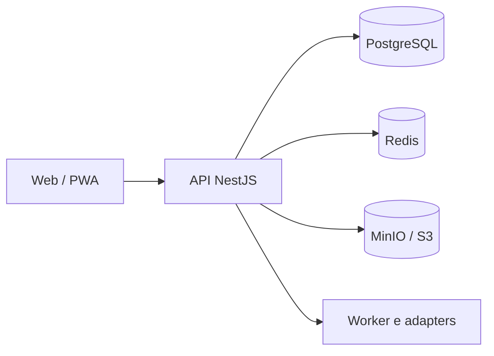

<div align="center">

<table>
<tr>
<td bgcolor="#F8FAFC" align="center">

</td>
</tr>
</table>

**Plataforma GovTech multiempresa para gestão de programas públicos de conectividade e inclusão digital, conectando municípios, cidadãos elegíveis e provedores participantes em uma operação segura, auditável e escalável.**

[](https://github.com/nicholasrichardsonsecurity/quero-internet/actions/workflows/ci.yml)
[](https://github.com/nicholasrichardsonsecurity/quero-internet/actions/workflows/security.yml)
[](#estado-atual)
[](#estado-atual)
[](#licença)
[](#segurança-e-privacidade)

### Stack principal

[](https://nodejs.org/)
[](https://pnpm.io/)
[](https://www.typescriptlang.org/)
[](https://nestjs.com/)
[](https://nextjs.org/)
[](https://www.postgresql.org/)
[](https://redis.io/)
[](https://www.prisma.io/)
[](https://docs.docker.com/compose/)

</div>

---

## Navegação

- [Visão do produto](#visão-do-produto)
- [O que oferecemos](#o-que-oferecemos)
- [Jornada operacional](#jornada-operacional)
- [Estado atual](#estado-atual)
- [Arquitetura](#arquitetura)
- [Instalação local](#instalação-local)
- [Instalação em Debian](#instalação-em-debian)
- [Homologação](#homologação)
- [Segurança e privacidade](#segurança-e-privacidade)
- [Documentação](#documentação)

## Visão do produto

O Quero Internet GovTech é uma plataforma para organizar programas públicos de conectividade e inclusão digital do planejamento à operação. O sistema conecta município, cidadão elegível e provedor participante em fluxos rastreáveis, com autorização contextual, evidências e auditoria.

A plataforma não é um provedor de internet, ERP de provedor, sistema financeiro público nem motor autônomo de decisão administrativa. A análise de elegibilidade e os atos administrativos permanecem sob responsabilidade humana e institucional.

## O que oferecemos

### Para municípios

- criação e organização de programas de conectividade;
- acompanhamento de beneficiários e solicitações;
- revisão humana e auditável de elegibilidade;
- encaminhamento controlado para provedores;
- dashboards operacionais e trilha de auditoria;
- evidências, indicadores e base para prestação de contas.

### Para provedores participantes

- fila contextual de solicitações autorizadas;
- aceite ou recusa justificada;
- avaliação de viabilidade técnica FTTH;
- gestão de instalação, agendamento e ativação;
- acompanhamento do serviço ativo;
- integração futura por adapters, com idempotência e reconciliação.

### Para cidadãos

- jornada organizada de solicitação;
- acompanhamento transparente do status;
- comunicação clara sobre análise e próximos passos;
- proteção de dados e minimização de informações.

## Jornada operacional

```text
Programa municipal
      ↓
Solicitação do cidadão
      ↓
Revisão humana de elegibilidade
      ↓
Encaminhamento ao provedor
      ↓
Viabilidade técnica FTTH
      ↓
Ordem de instalação
      ↓
Agendamento e execução
      ↓
Ativação e serviço ativo
```

## Estado atual

Estamos na Fase 1 — MVP operacional. A fundação técnica inclui:

- monorepo pnpm/Turborepo;
- API NestJS, Web Next.js e worker inicial;
- PostgreSQL com Prisma, Redis e MinIO/S3-compatible;
- autenticação por sessão opaca e RBAC contextual;
- núcleo multiempresa e multi-município;
- beneficiários, solicitações, elegibilidade humana e provedores;
- viabilidade FTTH, instalação, ativação e serviço ativo;
- auditoria, evidências, notificações sem envio externo e integrações simuladas somente leitura;
- logs JSON sanitizados, correlation ID e métricas básicas;
- CI e Security Gate com migrations, typecheck, testes, build e verificações de segurança.

> O projeto ainda não está aprovado para piloto público ou produção. Esse status depende de evidências completas de segurança, privacidade, acessibilidade, operação, backup/restore, homologação e aprovação formal do gate.

## Arquitetura



Estratégia: monólito modular TypeScript, workers assíncronos e adapters de integração. Microsserviços somente quando houver ADR, necessidade real e evidência operacional.

## Instalação local

### Requisitos

- Git;
- Node.js 22.x;
- pnpm 10.14.x;
- Docker Engine e Docker Compose;
- OpenSSL.

```bash
git clone git@github.com:nicholasrichardsonsecurity/quero-internet.git
cd quero-internet
pnpm install --frozen-lockfile=false
cp .env.example .env
docker compose -f infra/docker/docker-compose.yml up -d postgres redis minio
pnpm db:generate
pnpm db:validate
pnpm db:migrate:deploy
pnpm typecheck
pnpm test
pnpm build
pnpm dev
```

Preencha o `.env` com `DATABASE_URL`, `REDIS_URL`, `S3_ENDPOINT`, bucket e credenciais locais. Nunca commite `.env`, tokens ou secrets.

## Instalação em Debian

Execute em um Debian 12 ou superior com usuário autorizado a usar Docker:

```bash
sudo apt-get update
sudo apt-get install -y ca-certificates curl git openssl
curl -fsSL https://get.docker.com | sh
sudo usermod -aG docker "$USER"
```

Saia e entre novamente na sessão para aplicar o grupo Docker. Depois:

```bash
git clone git@github.com:nicholasrichardsonsecurity/quero-internet.git /opt/quero-internet/quero-internet
cd /opt/quero-internet/quero-internet
corepack enable
corepack prepare pnpm@10.14.0 --activate
pnpm install --frozen-lockfile=false
cp .env.example .env
pnpm db:generate
pnpm db:validate
pnpm --filter @quero-internet/api build
```

Em servidor, não use credenciais de exemplo. Prefira secret manager, firewall, TLS reverso, backups testados, logs sanitizados e serviços internos sem portas de banco publicadas.

## Homologação

Homologação é isolada do desenvolvimento e da produção, usa secrets próprios e somente dados sintéticos:

```bash
cp infra/docker/.env.homolog.example infra/docker/.env.homolog.local
chmod 600 infra/docker/.env.homolog.local
bash scripts/verify-homologation-config.sh
docker compose --env-file infra/docker/.env.homolog.local -f infra/docker/docker-compose.homolog.yml up -d postgres redis minio
```

Aplique as migrations, execute o seed sintético e rode o smoke test seguindo [`docs/operations/INSTALLATION.md`](docs/operations/INSTALLATION.md). O compose não publica PostgreSQL, Redis ou MinIO no host.

Não reutilize redes, volumes, containers ou portas de outros produtos no mesmo servidor.

## Segurança e privacidade

- autorização real no backend;
- isolamento por tenant e organização;
- documento bruto não persistido na fundação atual;
- deduplicação por HMAC com pepper externo;
- auditoria append-only;
- logs sem secrets, cookies, tokens ou dados pessoais desnecessários;
- migrations e testes de autorização obrigatórios;
- dados sintéticos em homologação;
- Security Gate verde antes do merge.

O projeto adota privacy by design / privacy by default. Não usa “LGPD compliant” como selo automático: conformidade também depende de processos, contratos, governança e operação.

## Documentação

- [`docs/operations/INSTALLATION.md`](docs/operations/INSTALLATION.md) — instalação e operação;
- [`docs/architecture/FOUNDATION.md`](docs/architecture/FOUNDATION.md) — fundação técnica;
- [`docs/architecture/IMPLEMENTATION-STATUS.md`](docs/architecture/IMPLEMENTATION-STATUS.md) — status por domínio;
- [`docs/brand/BRANDING-OFFICIAL-V1.2.md`](docs/brand/BRANDING-OFFICIAL-V1.2.md) — identidade e uso da marca;
- [`docs/operations/HOMOLOGATION-ENVIRONMENT.md`](docs/operations/HOMOLOGATION-ENVIRONMENT.md) — ambiente de homologação;
- [`docs/operations/HOMOLOGATION-EXECUTION.md`](docs/operations/HOMOLOGATION-EXECUTION.md) — execução e evidências;
- [`docs/operations/E2E-SMOKE-SPEC.md`](docs/operations/E2E-SMOKE-SPEC.md) — teste E2E;
- [`docs/operations/PILOT-GATE.md`](docs/operations/PILOT-GATE.md) — critérios de piloto;
- [`docs/security/SECURITY-BASELINE.md`](docs/security/SECURITY-BASELINE.md) — baseline de segurança;
- [`docs/privacy/PRIVACY-PRINCIPLES.md`](docs/privacy/PRIVACY-PRINCIPLES.md) — privacidade.

## Licença

Software proprietário. Consulte [`LICENSE.md`](LICENSE.md). Nenhum direito é concedido para copiar, distribuir, sublicenciar, revender, hospedar, modificar ou explorar comercialmente este projeto sem autorização formal do titular.