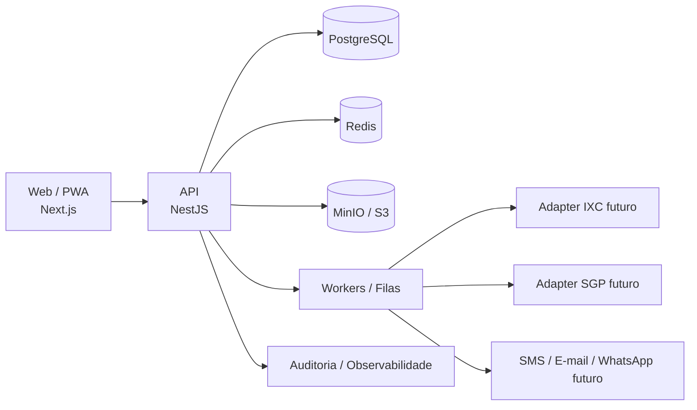

<div align="center">
  

  # Quero Internet GovTech

  **Conectando pessoas, transformando cidades.**

  Plataforma GovTech multiempresa para gestão de programas públicos de conectividade e inclusão digital, conectando municípios, cidadãos elegíveis e provedores locais em uma operação segura, auditável e escalável.

  
  
  
  

</div>

---

## Visão do produto

O **Quero Internet GovTech** foi concebido para operar programas públicos de conectividade sem transformar a plataforma em um provedor de internet, ERP, sistema financeiro público ou motor autônomo de decisão administrativa.

Municípios administram programas, cidadãos entram na jornada de solicitação, provedores participantes executam etapas técnicas e a plataforma registra estados, evidências futuras e auditoria. O objetivo é criar uma trilha segura, rastreável e escalável para inclusão digital.

A arquitetura é **multiempresa e multi-município** desde a fundação: uma única plataforma pode atender diferentes cidades, programas, provedores e operadores mantendo contexto, autorização, dados e auditoria segregados.

---

## Jornada principal do MVP operacional

```text
Programa municipal ativo
   ↓
Cadastro mínimo do beneficiário
   ↓
Solicitação do cidadão ao programa
   ↓
Revisão humana de elegibilidade
   ↓
Encaminhamento ao provedor participante
   ↓
Aceite ou recusa do provedor
   ↓
Viabilidade técnica FTTH
   ↓
Ordem de instalação
   ↓
Agendamento e execução em campo
   ↓
Instalação concluída
   ↓
Ativação registrada
   ↓
Serviço ativo inicial
```

> Elegibilidade, suspensão, pagamento, benefício público e autorização administrativa não são decididos por IA nem por um único status externo de ERP.

---

## Estado atual da fundação

A Fase 0.2 de arquitetura foi consolidada e a Fase 1 já possui fundação técnica funcional para a trilha operacional inicial.

Implementado até aqui:

- monorepo pnpm/Turborepo;
- API NestJS, Web Next.js e Worker inicial;
- PostgreSQL/Prisma, Redis e MinIO/S3 local;
- CI com validação Prisma, migrations PostgreSQL, typecheck, testes e build;
- Security Gate com auditoria de dependências e SAST/segredos;
- branding oficial v1.1;
- DMS mínimo de evidências com hash, classificação, finalidade, retenção e escopo por tenant;
- núcleo multiempresa: `Tenant`, `Organization`, `Program`, `ProgramParticipation`, `User`, `Membership`, `Session`, `AuditLog`;
- autenticação com sessão opaca e contexto organizacional;
- RBAC no backend;
- beneficiários, solicitações, elegibilidade humana, encaminhamento ao provedor, viabilidade FTTH, instalação/ativação e serviço ativo inicial.

O projeto ainda **não está aprovado para piloto público ou produção**. Esse gate depende de segurança, privacidade, observabilidade, backup/restore, acessibilidade, operação, homologação e evidências externas.

Documentos centrais:

- [`docs/architecture/FOUNDATION.md`](docs/architecture/FOUNDATION.md)
- [`docs/architecture/IMPLEMENTATION-STATUS.md`](docs/architecture/IMPLEMENTATION-STATUS.md)
- [`docs/architecture/BENEFICIARIES-APPLICATIONS.md`](docs/architecture/BENEFICIARIES-APPLICATIONS.md)
- [`docs/missions/1.5-installation-activation.md`](docs/missions/1.5-installation-activation.md)
- [`docs/missions/1.6-service-lifecycle-monitoring.md`](docs/missions/1.6-service-lifecycle-monitoring.md)

---

## Branding oficial

A marca oficial é **Quero Internet GovTech**.

**Slogan:** Conectando pessoas, transformando cidades.

**Posicionamento:** GovTech/SaaS para gestão operacional, segura e auditável de programas públicos de conectividade, conectando prefeitura, cidadão elegível e provedor participante.

O símbolo oficial combina **Q + conectividade + cidade + inclusão**, usando azul institucional, verde de conectividade e linguagem visual de plataforma pública moderna.

<p align="center">
  
</p>

<p align="center">
  
</p>

Diretrizes principais:

- Fonte operacional: **Inter**.
- Ícones: **Lucide Icons**.
- Sidebar institucional: `#081D3A`.
- Azul primário: `#2563EB`.
- Verde positivo/conectividade: `#22C55E`.
- Sistema de espaçamento: base de **8 px**.
- Meta de acessibilidade: **WCAG 2.2 AA**, sujeita a auditoria antes de qualquer declaração de conformidade.
- Comunicação sem promessa de aprovação automática, internet garantida ou decisão por IA.

Documentação de marca:

- [`docs/brand/BRAND-BOOK.md`](docs/brand/BRAND-BOOK.md)
- [`docs/brand/BRAND-TOKENS.json`](docs/brand/BRAND-TOKENS.json)
- [`docs/brand/MESSAGING.md`](docs/brand/MESSAGING.md)
- [`docs/brand/VISUAL-SYSTEM.md`](docs/brand/VISUAL-SYSTEM.md)
- [`docs/design/BRAND-GUIDELINES.md`](docs/design/BRAND-GUIDELINES.md)

---

## Arquitetura



Estratégia: **monólito modular + workers assíncronos + adapters de integração**. Bounded contexts não são sinônimo de microsserviços e só serão extraídos com ADR, evidência técnica e necessidade operacional real.

### Fronteiras permanentes

- Autorização real no backend.
- Tenant e organização derivados da sessão e das entidades persistidas.
- ERP externo não é fonte única de verdade.
- Escritas externas futuras precisam de idempotência, reconciliação, timeout e kill switch.
- Auditoria append-only para ações críticas.
- DTOs minimizados por contexto.
- Segurança e LGPD em cada incremento, não ao final.

---

## Stack tecnológica

| Camada | Tecnologia / estratégia |
|---|---|
| Web | Next.js + TypeScript |
| API | NestJS + TypeScript |
| Persistência | PostgreSQL + Prisma |
| Cache / coordenação | Redis |
| Arquivos | MinIO local / S3-compatible em ambientes externos |
| Assíncrono | Worker e filas futuras |
| Monorepo | pnpm + Turborepo |
| Contratos | OpenAPI e schemas versionados futuramente |
| Observabilidade | logs estruturados, correlation ID e evolução para OpenTelemetry |
| CI | GitHub Actions |
| Segurança SDLC | dependency audit + SAST/secret patterns |

---

## Integrações

Integrações externas são isoladas por adapters e capacidades homologadas. O domínio não depende diretamente de um ERP específico.

Prioridade futura:

- **IXC** para provedores participantes;
- **SGP** para provedores participantes;
- SMS, e-mail e WhatsApp transacional;
- webhooks com autenticação, deduplicação e reconciliação.

No estado atual, **não há escrita real automatizada em IXC/SGP**. Qualquer avanço nessa área precisa ser supervisionado, idempotente, auditável e reversível operacionalmente quando possível.

---

## Segurança

Segurança é requisito de arquitetura e de produto.

Controles materializados ou exigidos pela fundação:

- isolamento multiempresa e contextual;
- sessão opaca com hash persistido;
- RBAC/guard no backend;
- validação de entrada;
- gestão de secrets fora do código-fonte;
- proteção contra enumeração e abuso de login;
- logs sanitizados;
- trilha de auditoria para ações críticas;
- migrations com constraints quando regras são persistíveis;
- CI e Security Gate obrigatórios antes de merge;
- baseline alinhado a boas práticas OWASP/ASVS, sem declarar conformidade formal antes da auditoria correspondente.

Política: [`docs/security/SECURITY-BASELINE.md`](docs/security/SECURITY-BASELINE.md)

---

## LGPD e privacidade

O projeto adota **privacy by design / privacy by default** como princípio de engenharia.

Diretrizes centrais:

- finalidade e necessidade antes da coleta;
- minimização de dados;
- segregação por contexto e organização;
- documento bruto de cidadão não persistido na fundação atual;
- deduplicação por HMAC com pepper externo;
- compartilhamento apenas por finalidade autorizada;
- auditoria proporcional ao risco;
- ambientes de teste sem cópia indiscriminada de dados reais;
- fornecedores externos avaliados quanto a dados processados, retenção, suboperadores e transferências.

> A plataforma não usa o termo “LGPD compliant” como selo automático. Conformidade depende de processos, contratos, governança, operação e evidências além do código.

Princípios: [`docs/privacy/PRIVACY-PRINCIPLES.md`](docs/privacy/PRIVACY-PRINCIPLES.md)

---

## Estrutura do repositório

```text
apps/
  api/        API NestJS
  web/        Aplicação web Next.js
  worker/     Worker inicial
packages/
  database/   Prisma, schema e migrations
docs/
  agents/     Playbooks especializados
  architecture/
  brand/      Branding oficial, mensagens e tokens
  design/
  missions/
  privacy/
  product/
  security/
```

---

## Execução local

```bash
pnpm install
pnpm db:generate
pnpm db:validate
pnpm test
pnpm build
```

Com Docker local:

```bash
docker compose up -d postgres redis minio
pnpm db:migrate:deploy
pnpm dev
```

---

## Licença

Software proprietário. Ver [`LICENSE.md`](LICENSE.md).

Nenhum direito é concedido para copiar, distribuir, sublicenciar, revender, hospedar, modificar ou explorar comercialmente este projeto sem autorização expressa e formal do titular.
