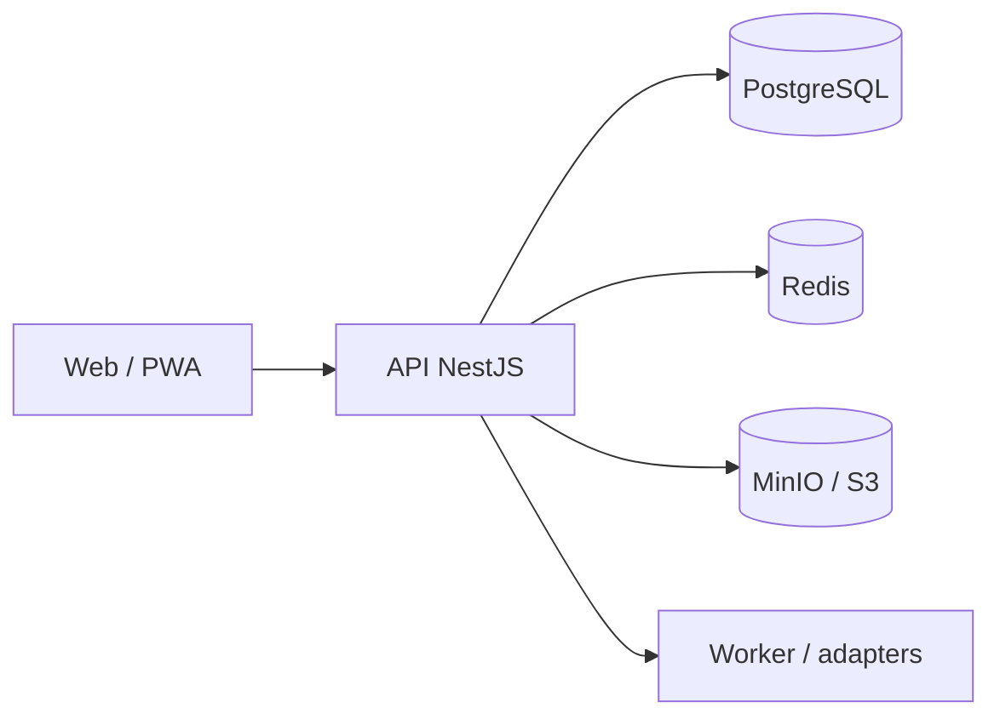

# Quero Internet GovTech

Plataforma GovTech multiempresa para gestão segura, auditável e escalável de programas públicos de conectividade e inclusão digital.

[](https://github.com/nicholasrichardsonsecurity/quero-internet/actions/workflows/ci.yml)
[](https://nodejs.org/)
[](https://pnpm.io/)
[](https://www.typescriptlang.org/)
[](https://nestjs.com/)
[](https://nextjs.org/)
[](https://www.postgresql.org/)
[](https://redis.io/)
[](https://www.prisma.io/)
[](https://docs.docker.com/compose/)

> Conectando pessoas, transformando cidades.

## O que é

O Quero Internet GovTech coordena a jornada entre município, cidadão elegível e provedor participante. A plataforma não é um provedor de internet, ERP de provedor, sistema financeiro público ou motor autônomo de decisão administrativa.

A fundação é multiempresa e multi-município: tenant, organização, programa, autorização contextual, estados de domínio e auditoria são tratados desde o início.

## Jornada do MVP

```text
Programa municipal → solicitação → revisão humana de elegibilidade
→ encaminhamento ao provedor → viabilidade FTTH → instalação
→ ativação → serviço ativo e acompanhamento operacional
```

Elegibilidade, suspensão, pagamento, benefício público e autorização administrativa não são decididos por IA nem por um status isolado de ERP.

## Estado atual

A fundação técnica do MVP operacional está implementada, com API NestJS, Web Next.js, worker inicial, PostgreSQL/Prisma, Redis, MinIO/S3-compatible, autenticação contextual, RBAC, auditoria, evidências, integrações simuladas somente leitura, notificações sem envio externo e observabilidade inicial.

O projeto ainda não está aprovado para piloto público ou produção. Segurança, privacidade, backup/restore, acessibilidade, operação, homologação e evidências externas continuam sendo gates obrigatórios.

## Instalação rápida

### Pré-requisitos

- Git;
- Node.js 22.x;
- pnpm 10.14.x;
- Docker Engine e Docker Compose;
- OpenSSL.

### Local

```bash
git clone git@github.com:nicholasrichardsonsecurity/quero-internet.git
cd quero-internet
pnpm install --frozen-lockfile=false
cp .env.example .env
docker compose -f infra/docker/docker-compose.yml up -d postgres redis minio
pnpm db:generate
pnpm db:validate
pnpm db:migrate:deploy
pnpm typecheck
pnpm test
pnpm build
pnpm dev
```

Configure `DATABASE_URL`, `REDIS_URL`, `S3_ENDPOINT`, bucket e credenciais no `.env`. Nunca commite `.env` ou secrets.

### Homologação

Homologação usa secrets próprios, dataset sintético, rede interna e volumes separados:

```bash
cp infra/docker/.env.homolog.example infra/docker/.env.homolog.local
chmod 600 infra/docker/.env.homolog.local
bash scripts/verify-homologation-config.sh
docker compose --env-file infra/docker/.env.homolog.local -f infra/docker/docker-compose.homolog.yml up -d postgres redis minio
```

Depois aplique migrations, execute o seed sintético e rode o smoke test conforme [`docs/operations/INSTALLATION.md`](docs/operations/INSTALLATION.md).

Não publique PostgreSQL, Redis ou MinIO no host e não reutilize dados reais. Para coexistir com outros produtos, mantenha compose project, rede, volumes e portas isolados.

## Arquitetura



Estratégia: monólito modular TypeScript, workers assíncronos e adapters de integração. Microsserviços só devem surgir mediante ADR e evidência operacional.

## Stack

| Camada | Tecnologia |
|---|---|
| Web | Next.js + TypeScript |
| API | NestJS + TypeScript |
| Persistência | PostgreSQL + Prisma |
| Cache e coordenação | Redis |
| Arquivos | MinIO local / S3-compatible |
| Monorepo | pnpm + Turborepo |
| CI | GitHub Actions |
| Segurança | dependency audit, SAST e secret patterns |

## Documentação

- [`docs/operations/INSTALLATION.md`](docs/operations/INSTALLATION.md) — instalação local, homologação, validação e operação;
- [`docs/architecture/FOUNDATION.md`](docs/architecture/FOUNDATION.md) — princípios e fronteiras técnicas;
- [`docs/architecture/IMPLEMENTATION-STATUS.md`](docs/architecture/IMPLEMENTATION-STATUS.md) — status por domínio;
- [`docs/operations/HOMOLOGATION-ENVIRONMENT.md`](docs/operations/HOMOLOGATION-ENVIRONMENT.md) — requisitos do ambiente;
- [`docs/operations/HOMOLOGATION-EXECUTION.md`](docs/operations/HOMOLOGATION-EXECUTION.md) — execução e evidências;
- [`docs/operations/E2E-SMOKE-SPEC.md`](docs/operations/E2E-SMOKE-SPEC.md) — jornada E2E e casos negativos;
- [`docs/operations/PILOT-GATE.md`](docs/operations/PILOT-GATE.md) — critérios para piloto;
- [`docs/security/SECURITY-BASELINE.md`](docs/security/SECURITY-BASELINE.md) — baseline de segurança;
- [`docs/privacy/PRIVACY-PRINCIPLES.md`](docs/privacy/PRIVACY-PRINCIPLES.md) — privacidade e LGPD.

## Segurança e privacidade

- autorização real no backend;
- contexto de tenant e organização derivado da sessão;
- documento bruto não persistido na fundação atual;
- deduplicação por HMAC com pepper externo;
- auditoria append-only e logs sanitizados;
- secrets fora do código-fonte;
- Security Gate verde antes de merge.

A plataforma não usa “LGPD compliant” como selo automático. Conformidade depende também de processos, contratos, governança, operação e evidências.

## Licença

Software proprietário. Consulte [`LICENSE.md`](LICENSE.md). Nenhum direito é concedido para copiar, distribuir, sublicenciar, revender, hospedar, modificar ou explorar comercialmente este projeto sem autorização formal do titular.