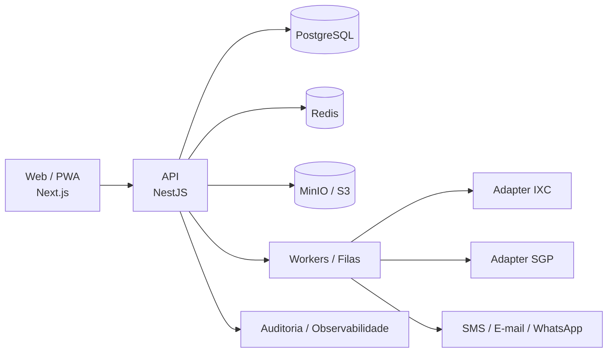

<div align="center">
  

  # Quero Internet GovTech

  **Conectando pessoas, transformando cidades.**

  Plataforma GovTech multiempresa para gestão de programas públicos de conectividade e inclusão digital, conectando municípios, cidadãos elegíveis e provedores locais em uma operação segura, auditável e escalável.

  
  
  
  

</div>

---

## Visão do produto

O **Quero Internet** foi concebido para operar programas de conectividade sem transformar a plataforma em um provedor de internet. Municípios e outros entes responsáveis administram seus programas, provedores participantes executam viabilidade, instalação e ativação, e o cidadão acompanha sua jornada com linguagem simples e canais digitais acessíveis.

A arquitetura é **multiempresa e multi-município**: uma única plataforma pode atender diferentes cidades, programas e provedores mantendo contexto, autorização, dados, auditoria e regras de negócio segregados.

### Jornada principal

```text
Programa público
   ↓
Solicitação do cidadão
   ↓
Elegibilidade e análise
   ↓
Encaminhamento ao provedor
   ↓
Viabilidade técnica/comercial
   ↓
Instalação FTTH / acesso aplicável
   ↓
Provisionamento e ativação confirmada
   ↓
Acompanhamento, indicadores e prestação de contas
```

> Ativação, elegibilidade e pagamentos não são inferidos por um único status externo. O domínio utiliza regras versionadas, evidências, reconciliação e auditoria.

---

## Identidade visual oficial

O símbolo oficial combina **Q + conectividade + cidade + inclusão**, usando azul institucional, verde de conectividade e um acento brasileiro discreto. A identidade foi projetada para comunicar GovTech, telecom, confiança e escala nacional sem aparência de protótipo.

<p align="center">
  
</p>

<p align="center">
  
</p>

- Fonte operacional: **Inter**
- Ícones: **Lucide Icons**
- Sidebar institucional: `#081D3A`
- Azul primário: `#2563EB`
- Verde positivo/conectividade: `#22C55E`
- Sistema de espaçamento: base de **8 px**
- Meta de acessibilidade: **WCAG 2.2 AA**, sujeita a auditoria antes de qualquer declaração de conformidade

Documentação completa: [`docs/design/BRAND-GUIDELINES.md`](docs/design/BRAND-GUIDELINES.md)

---

## Arquitetura



Estratégia inicial: **monólito modular + workers assíncronos + adapters de integração**. Bounded contexts não são sinônimo de microsserviços e poderão evoluir com evidência técnica e operacional.

### Núcleo multiempresa

O modelo fundamental inclui:

`Tenant` · `Organization` · `OrganizationalUnit` · `Program` · `ProgramParticipation` · `User` · `Membership` · `Session` · `AuditLog`

O acesso é contextual e a autorização real ocorre no backend. Esconder um botão no frontend nunca é tratado como controle de segurança.

---

## Stack tecnológica

<div align="center">


</div>

| Camada | Tecnologia / estratégia |
|---|---|
| Web | Next.js + TypeScript |
| API | NestJS + TypeScript |
| Persistência | PostgreSQL + Prisma |
| Cache / coordenação | Redis |
| Arquivos | MinIO local / S3-compatible em ambientes externos |
| Assíncrono | Workers e mensageria, com idempotência e reconciliação |
| Monorepo | pnpm + Turborepo |
| Contratos | OpenAPI + schemas versionados |
| Observabilidade | logs estruturados, correlation ID e evolução para OpenTelemetry |
| CI | GitHub Actions |

---

## Integrações

Integrações externas são isoladas por adapters e capacidades homologadas. O domínio não depende diretamente de um ERP específico.

### Prioridade inicial

- **IXC** — integração com provedores participantes
- **SGP** — integração com provedores participantes
- SMS — provider substituível
- E-mail — SMTP/API com políticas de entrega
- Webhooks — inbox, autenticação, deduplicação e reconciliação

Operações externas de escrita devem ter idempotência, timeout, resultado indeterminado, kill switch e trilha de auditoria quando aplicável.

---

## Segurança

Segurança é requisito de arquitetura e de produto, não uma etapa aplicada no final.

Controles previstos e progressivamente materializados:

- isolamento multiempresa e contextual;
- RBAC/ABAC no backend;
- MFA para perfis privilegiados conforme risco;
- validação de entrada e schemas tipados;
- gestão de secrets fora do código-fonte;
- rate limiting e proteção contra enumeração;
- logs sanitizados sem dados pessoais desnecessários;
- trilha de auditoria para ações críticas;
- criptografia em trânsito e em repouso conforme camada;
- dependency/secret scanning no SDLC;
- testes de autorização e acesso cruzado entre tenants;
- threat modeling e baseline baseado em boas práticas OWASP/ASVS, sem declarar conformidade antes da verificação correspondente.

Política: [`docs/security/SECURITY-BASELINE.md`](docs/security/SECURITY-BASELINE.md)

---

## LGPD e privacidade

O projeto adota **privacy by design / privacy by default** como princípio de engenharia.

Diretrizes centrais:

- finalidade e necessidade antes da coleta;
- minimização de dados;
- segregação por contexto e organização;
- classificação e retenção por categoria documental/dado;
- compartilhamento somente por finalidade autorizada;
- auditoria proporcional ao risco;
- proteção de documentos e evidências;
- ambientes de teste sem cópia indiscriminada de dados reais;
- fornecedores externos avaliados quanto a dados processados, retenção, suboperadores e transferências quando aplicável;
- suporte a governança dos direitos dos titulares conforme o papel jurídico de cada participante.

> A plataforma não usa o termo “LGPD compliant” como selo automático. Conformidade depende de processos, contratos, governança, operação e evidências além do código.

Princípios: [`docs/privacy/PRIVACY-PRINCIPLES.md`](docs/privacy/PRIVACY-PRINCIPLES.md)

---

## Estrutura do repositório

```text
apps/
  api/             API NestJS
  web/             aplicação web / shells por contexto
  worker/          processamento assíncrono
packages/
  config/          configuração e validação de ambiente
  database/        Prisma e persistência
  domain/          conceitos compartilhados quando justificados
  authorization/   políticas de autorização
  integrations/    contratos/adapters de integração
  observability/   telemetria e correlação
  security/        primitivas e controles compartilhados
infra/
  docker/          infraestrutura local
  observability/   evolução da stack operacional
docs/
  adr/             Architecture Decision Records
  architecture/    arquitetura consolidada
  design/          Brand & Design System
  privacy/         privacidade e LGPD
  security/        segurança
  operations/      runbooks e operação
```

---

## Desenvolvimento local

Pré-requisitos atuais: Node.js suportado pelo workspace, pnpm 10.14.x e Docker.

```bash
pnpm install

docker compose -f infra/docker/docker-compose.yml up -d

pnpm db:generate
pnpm typecheck
pnpm test
pnpm build
pnpm dev
```

API local prevista em `http://localhost:3001`.

Endpoints fundamentais:

```text
GET /health
GET /ready
```

`/health` indica vida do processo. `/ready` evolui para representar prontidão das dependências necessárias; os dois conceitos não devem ser confundidos.

---

## Estado do projeto

**Fase 0.2 — Arquitetura:** concluída e aprovada para início da fundação técnica.

**Fase 1 — Fundação Técnica e MVP:** em implementação.

O projeto ainda **não está aprovado para piloto ou produção**. Gates posteriores exigirão evidências de segurança, privacidade, observabilidade, restauração, integração, usabilidade, acessibilidade e operação.

---

## Agentes e IA

Agentes de programação podem auxiliar em implementação, revisão, testes e documentação, mas não são autoridade arquitetural nem decisória.

IA não deve decidir autonomamente elegibilidade de cidadão, repasse público, penalidade, bloqueio ou outro ato administrativo de alto impacto. Decisões assistidas exigem governança, explicabilidade proporcional e revisão humana apropriada.

Regras: [`AGENTS.md`](AGENTS.md)

---

## Licença e propriedade intelectual

**Software proprietário — All Rights Reserved.**

Copyright © 2026 **Nicholas Richardson**.

Sem autorização prévia, expressa e escrita do proprietário, é proibido copiar, reproduzir, modificar, distribuir, sublicenciar, vender, revender, comercializar, oferecer como SaaS/serviço, criar derivados ou explorar economicamente o software, documentação, arquitetura e identidade visual.

O acesso a este repositório privado não implica concessão de licença.

Componentes de terceiros permanecem sujeitos às respectivas licenças.

Leia os termos completos em [`LICENSE`](LICENSE).

---

<div align="center">


**Quero Internet GovTech**  
*Conectando pessoas, transformando cidades.*

2026 · Todos os direitos reservados.

</div>
